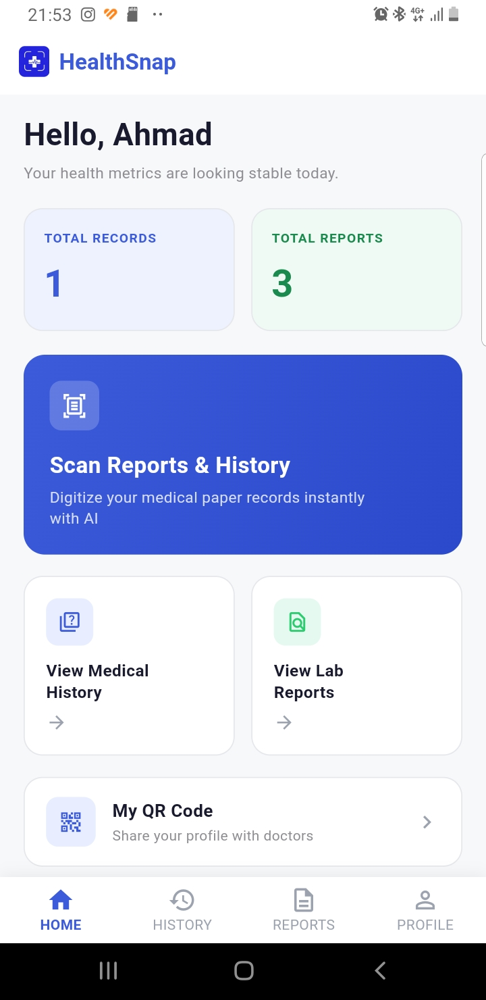
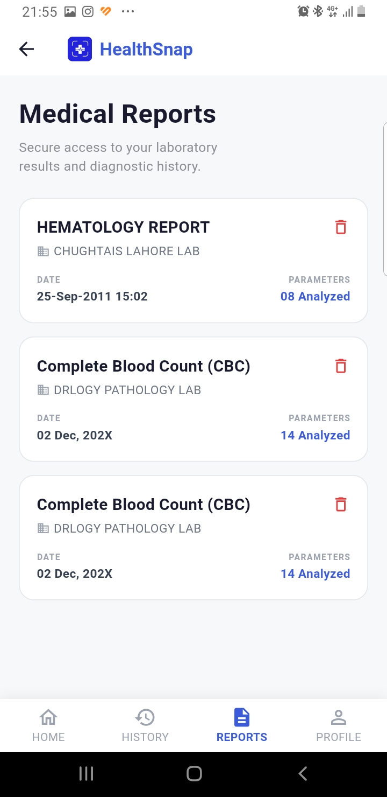
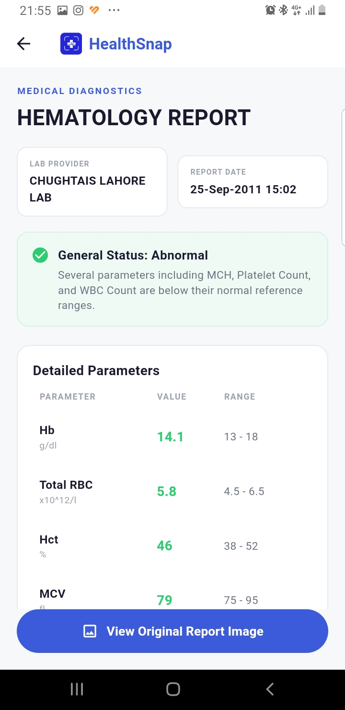
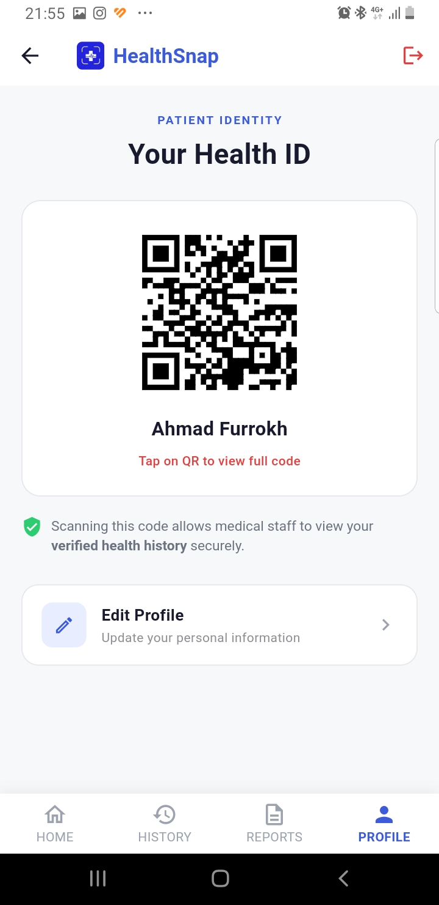
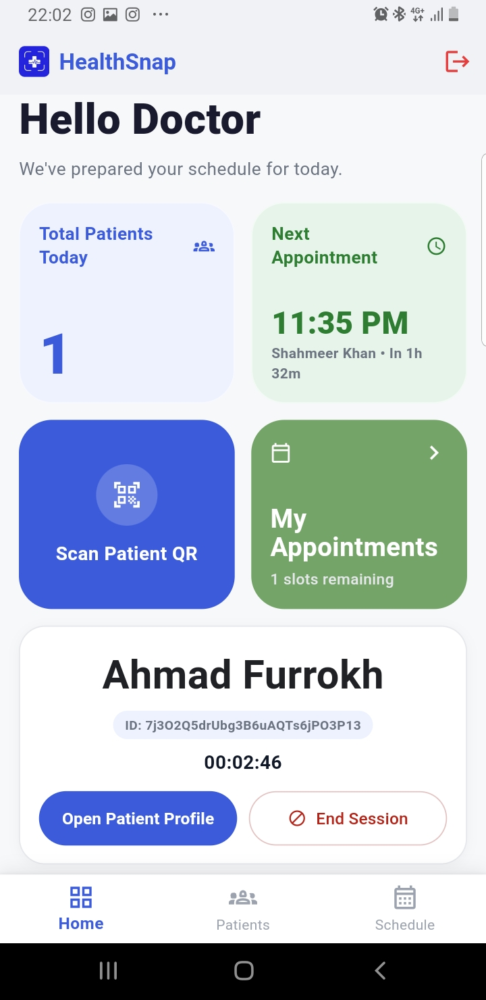
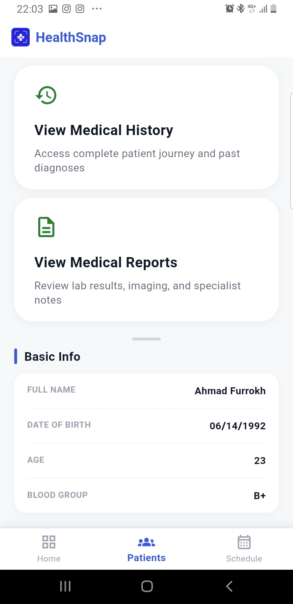
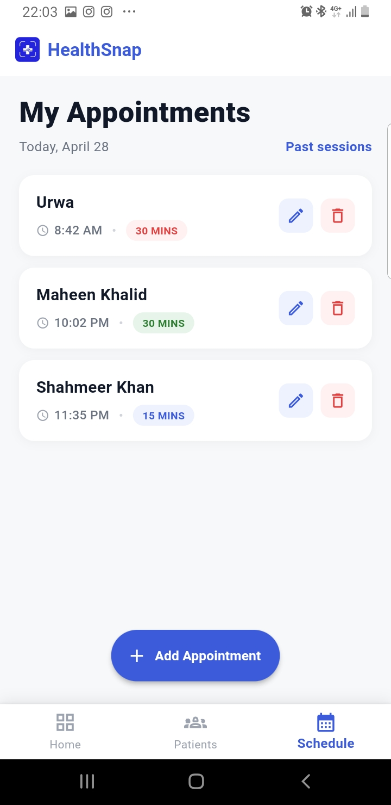
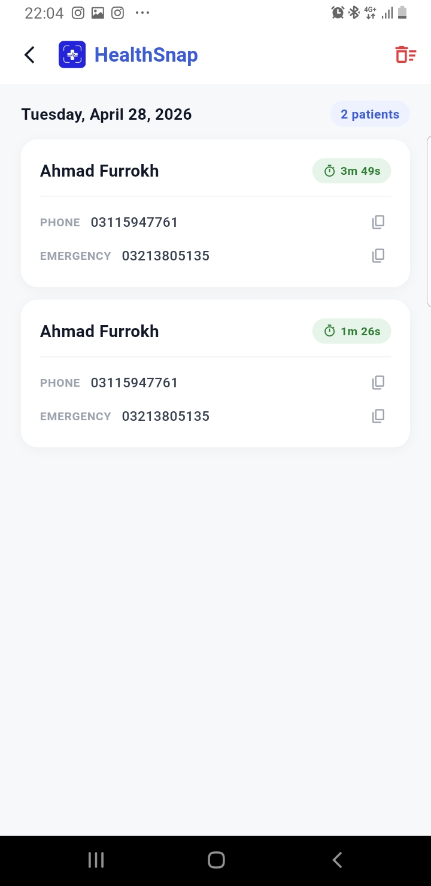

<div align="center">


# HealthSnap 🏥📱

**Digital Medical Records Management App**

Scan it. Store it. Share it with your doctor — securely, with a single QR code.

[](https://flutter.dev)
[](https://firebase.google.com)
[](https://ai.google.dev)
[](#)

🌐 **Website & demo:** [healthsnapweb.netlify.app](https://healthsnapweb.netlify.app/)

</div>

---

## 📖 About

HealthSnap is a Flutter-based mobile application that digitizes patient medical records in Pakistan. It removes the dependency on paper prescriptions and lab reports through **OCR scanning**, **AI-generated summaries**, and **QR-based doctor sharing**.

It was built as our *Technology and Entrepreneurship* course project and is currently a prototype / educational project.

## 🚩 Problem

Most patients in Pakistan still keep prescriptions, lab reports and medical history on paper. This leads to:

- Lost or damaged reports
- Doctors unable to see previous history
- Duplicate tests being ordered
- Longer consultations
- Disorganized records

## 💡 Solution

HealthSnap digitizes medical records and makes them instantly available to both patients and doctors through a secure, role-based mobile app. The patient scans a report once; the app extracts the data, organizes it, and lets the doctor view it during a consultation by scanning a QR code. When the session ends, the doctor's access ends too.

## 🔄 How It Works

1. **Scan** — the patient photographs a lab report or medical history document.
2. **Extract** — OCR + Gemini AI pull out the doctor name, diagnosis, medicines, test names and values.
3. **Store** — structured data goes to Cloud Firestore, report images to Cloudinary.
4. **Share** — the patient shows a dynamic QR code (their *Health ID*).
5. **Consult** — the doctor scans the QR and gets temporary access to the records.
6. **Revoke** — the doctor ends the session and access is removed.

## ✨ Features

| | Feature | Description |
|---|---|---|
| 🔐 | Authentication | Firebase Auth with role-based access (Patient / Doctor) |
| 📄 | OCR Scanning | Extracts doctor name, diagnosis, medicines, test values |
| 🤖 | AI Summaries | Auto-generated summary and status for each uploaded report |
| 📱 | QR Sharing | Dynamic QR codes for secure, temporary doctor access |
| 🔒 | Session Control | Doctor access is revoked once the consultation ends |
| 📅 | Appointments | Doctors create, edit and delete appointments |
| ☁️ | Cloud Storage | Cloudinary for images, Firestore for structured data |

---

## 📸 Screenshots

### 🧑‍⚕️ Patient App

<table>
  <tr>
    <td align="center"><br/><b>Dashboard</b><br/><sub>Total records & reports, quick actions</sub></td>
    <td align="center"><br/><b>Medical Reports</b><br/><sub>All scanned lab reports</sub></td>
    <td align="center"><br/><b>Report Details</b><br/><sub>AI status & parameter ranges</sub></td>
    <td align="center"><br/><b>Health ID</b><br/><sub>QR code for doctors</sub></td>
  </tr>
</table>

### 👨‍⚕️ Doctor App

<table>
  <tr>
    <td align="center"><br/><b>Dashboard</b><br/><sub>Scan QR, active session timer</sub></td>
    <td align="center"><br/><b>Patient Profile</b><br/><sub>History, reports, basic info</sub></td>
    <td align="center"><br/><b>Appointments</b><br/><sub>Manage today's schedule</sub></td>
    <td align="center"><br/><b>Past Sessions</b><br/><sub>Previous consultations</sub></td>
  </tr>
</table>

---

## 👥 User Modules

### Patient
- Register / log in
- Scan and upload lab reports and medical history
- OCR-based automatic data extraction
- AI-generated report summaries
- Browse organized history and reports
- Dynamic QR code (Health ID) for sharing
- Dashboard with total records and reports

### Doctor
- Log in
- Scan a patient's QR code to open their records instantly
- View medical history, diagnoses, medicines and test values
- Manage appointments
- End the session to revoke access (privacy protection)

## 🛠️ Tech Stack

| Layer | Technology |
|---|---|
| Frontend | Flutter (Dart) |
| Authentication | Firebase Authentication |
| Database | Cloud Firestore |
| Image Storage | Cloudinary |
| OCR & AI | Google Gemini (`gemini-2.5-flash`) |
| QR System | `qr_flutter` (generate), `mobile_scanner` (scan) |
| Version Control | Git & GitHub |
| UI/UX Design | Google Stitch |

## 🚀 Getting Started

**Prerequisites:** Flutter SDK, Android Studio or VS Code, and an Android device or emulator.

```bash
# 1. Clone the repository
git clone https://github.com/ahmadfurrokh29/HealthSnap.git
cd HealthSnap

# 2. Install dependencies
flutter pub get

# 3. Run the app
flutter run
```

To use your own backend, create a Firebase project, run `flutterfire configure` to regenerate `lib/firebase_options.dart`, and provide your own Gemini API key and Cloudinary credentials.

## ⚠️ Limitations

- Handwritten prescriptions are not always extracted accurately; printed reports work well.
- Low-quality images reduce OCR accuracy, and complex report layouts may need manual correction.
- X-rays, MRI, CT and other radiology images are not supported yet.
- This is a prototype. Commercial use would need proper security, patient consent and regulatory compliance (e.g. Ministry of National Health Services, Regulations and Coordination).

## 🔮 Future Work

- More accurate OCR and AI models for handwritten prescriptions
- Medical imaging support (X-ray, MRI, CT)
- End-to-end encryption and secure Base64 storage inside Firestore
- Appointment reminders and push notifications
- iOS and web support, multi-language support
- Revenue model: doctor premium subscription, clinic advertisements, laboratory integrations

## 👨‍💻 Team

| Name | Role |
|---|---|
| Ahmad Furrokh | Team Lead & Developer |
| Maheen Khalid | Marketing Manager |
| Shahmir Khan | Social Media & Finance |
| Ambar Shahid | Designer |
| Jawad Asad | Operations Manager |

*Technology and Entrepreneurship Project — submitted to Sir Abdul Rafay, May 2026.*

---

<div align="center">
Made with ❤️ using Flutter
</div>
